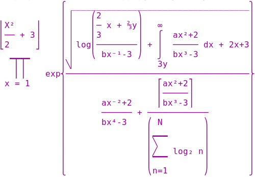

text-block
==========
Render math equations written in Racket as 2D unicode.

Currently unstable. All bug reports and comments are welcome.

The following code:
```racket
#lang racket
(require text-block)

(displayln
   (tblock-happend
     #:align 'baseline
     ($product "x=1" ($floor ($+ ($/ "X²" "2") "3")))
     "exp"
     ($brace ($/ ($sqrt
                  ($+ (tblock-happend
                       "log"
                       ($paren ($/ ($* ($/ 2 3) "x")
                                   "bx³-3")))
                      (tblock-happend
                       ($integral "3y" "∞")
                       (tblock-happend
                        ($/ "ax²+2"
                            "bx³-3")
                        " dx"))
                      "2x+3"))
       ($+ ($/ "ax²+2"
               "bx³-3")
           ($/ ($square-bracket
                ($/ "ax²+2"
                    "bx³-3"))
               ($paren (tblock-happend ($sum "n=1" "N") "log(n)"))))))))
```
produces this output
```
            ⎧ ▁▁▁▁▁▁▁▁▁▁▁▁▁▁▁▁▁▁▁▁▁▁▁▁▁▁▁▁▁▁▁▁⎫
            ⎪ ▏   ⎛⎛2⎞  ⎞                     ⎪
⎢X²    ⎥    ⎪ ▏   ⎜⎜─⎟ x⎟   ∞                 ⎪
⎢── + 3⎥    ⎪ ▏   ⎜⎝3⎠  ⎟   ⎧  ax²+2          ⎪
⎣2     ⎦    ⎪ ▏log⎜─────⎟ + ⎪  ───── dx + 2x+3⎪
  ▁▁▁▁      ⎪ ▏   ⎝bx³-3⎠   ⎭  bx³-3          ⎪
   ⎜⎟       ⎪╲▏             3y                ⎪
   ⎜⎟    exp⎨─────────────────────────────────⎬
  x=1       ⎪                ⎡ax²+2⎤          ⎪
            ⎪                ⎢─────⎥          ⎪
            ⎪      ax²+2     ⎣bx³-3⎦          ⎪
            ⎪      ───── + ────────────       ⎪
            ⎪      bx³-3   ⎛ N        ⎞       ⎪
            ⎪              ⎜▁▁▁       ⎟       ⎪
            ⎪              ⎜╲         ⎟       ⎪
            ⎪              ⎜╱   log(n)⎟       ⎪
            ⎪              ⎜▔▔▔       ⎟       ⎪
            ⎩              ⎝n=1       ⎠       ⎭
```
A number of renderers add empty pixel lines between text lines,
which prevents a nice rendering. Here's what it looks like with a good 
editor:



To obtain this result in DrRacket, uncheck
`Preferences|Editing|General Editing|Add one pixel of extra space between lines`.
 


